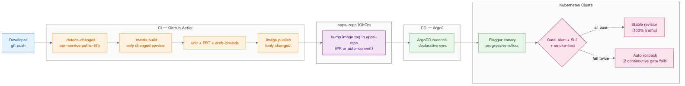

# ADR-0004: Canary Release Gated by Alert + SLO + Error Budget

- **Status**: Accepted
- **Context**: progressive rollout strategy in production



This ADR governs the bottom-right portion of the diagram above (the gate + stable / rollback path).

## Context

A canary release shifts a fraction of traffic to a new version, monitors metrics, then promotes or rolls back. The hard question is **which metrics gate promotion**.

Common (and flawed) answer: HTTP 5xx rate < X% AND p95 latency < Y ms.

This passes when:
- The 5% canary traffic happens to be cache-hit-heavy
- Background workers (not on the request path) are quietly failing
- A specific tenant's traffic isn't routed to canary at all
- The new version emits the same metrics with a different label (silent drop)

## Decision

Gate canary promotion on a **three-source predicate**:

1. **Alert state**: no critical Alertmanager alerts firing for the canary version's labels (catches "new version + new alert that didn't exist on baseline")
2. **SLO budget**: rolling 1-hour error-budget burn < threshold (catches "subtle SLO regression that doesn't trip a single alert")
3. **Health-check + smoke-test**: synthetic transactions against the canary's specific revision pass within latency band

Implemented with Flagger:

```yaml
analysis:
  metrics:
    - name: canary-error-rate
      thresholdRange: { max: 1 }
    - name: canary-latency-p99
      thresholdRange: { max: 500 }
    - name: error-budget-burn-1h        # custom metric from SLO-tracker
      thresholdRange: { max: 2.0 }
  webhooks:
    - name: pre-rollout-smoke-test
      url: http://smoke-runner.canary-tools/run
    - name: alert-state-check
      url: http://alert-gate.canary-tools/check
  iterations: 10
  stepWeight: 10
```

## Why three sources, not one

A single threshold is gameable by chance. A three-source AND is much harder to fool simultaneously:

| Failure mode | Single-metric? | Three-source? |
|---|---|---|
| Canary handles cache-hit-heavy traffic | passes ✗ | smoke-test catches the cold path |
| Background-only regression | passes ✗ | alert state likely fires |
| Subtle SLO regression | passes ✗ | error-budget burn catches it |
| Label-drop silent metric loss | passes ✗ | alert "metric absent" fires; budget can't compute |

## Rollback policy

- **Auto-rollback** when any gate fails twice in a row (avoid single-blip overreaction)
- **Manual rollback**: a single `kubectl annotate canary <name> flagger.app/rollback=true` (or revert PR in apps-repo)
- **Rollback time target**: < 5 minutes from alert to traffic-fully-on-baseline

## Anti-patterns to avoid

- **Canary on too-low traffic share**: 1% traffic for 5 minutes can't statistically distinguish noise from regression. Either go 5–10% or run longer.
- **Canary without baseline isolation**: if some tenants always hit baseline (sticky routing), canary signal is biased. Use random shard, not tenant-sticky.
- **Promoting on green metrics, ignoring tickets**: customer support reports are also a signal source. A 24-hour soak against canary catches what 30-minute progressive rollout misses.

## Consequences

### What you must build

- An SLO tracker emitting `error-budget-burn` as a Prometheus metric (a small Python service or Sloth)
- Smoke-test runner accessible from inside the cluster
- Alert-state-check endpoint that queries Alertmanager for current alerts filtered by canary labels
- Tooling to roll back from chat (Slack `/rollback canary-name`)

### What you get

- Automatic rejection of canary versions that regress reliability, even when no single metric trips
- Audit trail in the canary resource of which gate failed
- Confidence to roll out at higher frequency (each canary has stronger evidence)

## Validation

Drill-test the gates by intentionally regressing in a non-prod env:

1. Deploy canary that drops 5% of requests on a specific endpoint → expect SLO-burn gate to fail
2. Deploy canary that triggers a background-job alert → expect alert-state gate to fail
3. Deploy canary that breaks a synthetic-transaction journey → expect smoke-test gate to fail

If any of these passes promotion, the gate is misconfigured.

## Related

- [ADR-0001](0001-incremental-ci.md) — what produces the artefact
- [ADR-0002](0002-argocd-gitops.md) — what places the artefact in cluster
